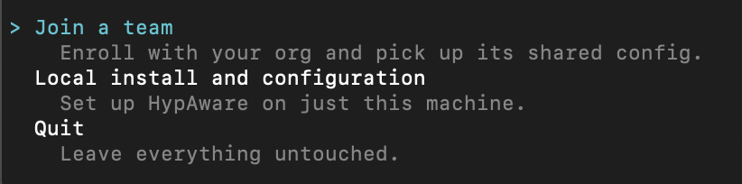
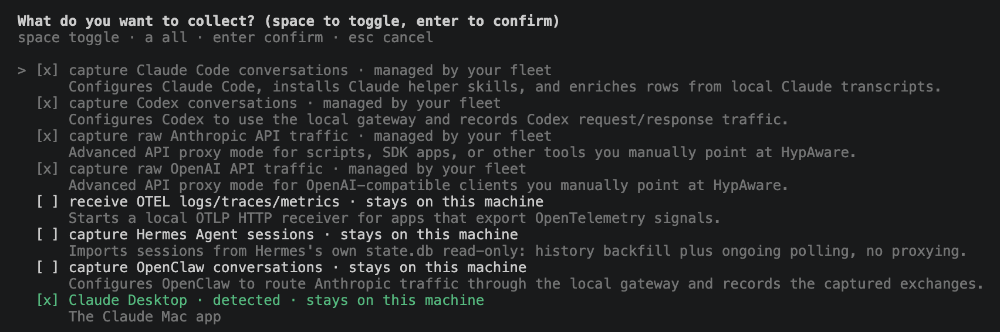

# Set up HypAware for your team

Get an organization on the central server, then set up each machine to join
it.

## Get an organization

Organizations are hosted on the central server and keyed by email domain:
anyone who signs in with a verified email on your claimed domain joins your
organization automatically. 

> To get an organization,
> [get in touch](https://hyperparam.app/contact) and we will set one up for your
> domain.

## Run the setup

HypAware requires **Node 22.12 or newer**. Run:

```sh
npx hypaware
```

This opens a guided setup. The first question is whether to join your team
or set up locally. Select **Join a team**.



## Follow the prompts

The setup guides you through the remaining steps and reports what it is
doing at each one:

1. **Sign in.** A browser window opens for sign-in with your work email.
   This completes enrollment: your organization is identified from your
   email address, so there are no codes or keys to enter.
2. **Select what to record.** A checklist of AI tools. Tools your team
   manages are already selected; tools detected on your machine are
   pre-selected as well. Any tool you add yourself is marked **stays on
   this machine** and is never forwarded to the server.
3. **Complete any additional setup.** Some tools require one further step
   (Claude Desktop, for example, requests your password and an application
   restart). You may defer any of these; the remaining setup continues.



The setup then installs the components, imports your recent AI history, and
reports when the first upload will occur.

> **Nothing is uploaded immediately.** The first upload is held until
> tonight, leaving a window to review what will be shared. Before then, run
> the `hypaware-privacy` skill to see what would be shared and keep any
> private material off the record. See
> [what HypAware records and how to control it](./PRIVACY.md).

## Verify the setup

```sh
hyp status
```

This reports whether recording is active, what is shared with your team
versus kept on your machine, and any pending upload deadline. To disconnect
and undo the setup, run `hyp leave`.

## Explore what was recorded

Because setup imports your recent history, there is data to query
immediately. Two queries to start with:

```sh
# Which providers and models you use, by volume
hyp query sql "select provider, model, count(*) n from ai_gateway_messages group by 1,2 order by n desc"

# Sessions and message parts per day, most recent first
hyp query sql "select date, count(distinct session_id) sessions, count(*) parts from ai_gateway_messages group by 1 order by 1 desc limit 14"
```
