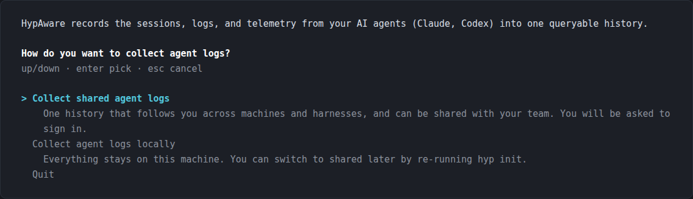
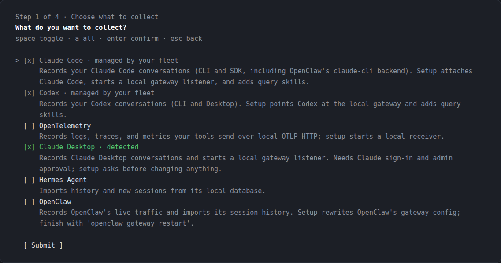

# Set up HypAware for your team

Get an organization on the central server, then set up each machine to join
it.

## Get an organization

Organizations are hosted on the central server and keyed by email domain:
anyone who signs in with a verified email on your claimed domain joins your
organization automatically. 

> To get an organization,
> [get in touch](https://hyperparam.app/contact) and we will set one up for your
> domain.

## Run the setup

HypAware requires **Node 22.12 or newer**. Run:

```sh
npx hypaware
```

This opens a guided setup. The first question is how you want to collect
agent logs. Select **Collect shared agent logs**.



## Follow the prompts

The setup guides you through the remaining steps and reports what it is
doing at each one:

1. **Sign in.** A browser window opens for sign-in with your work email.
   This completes enrollment: your organization is identified from your
   email address, so there are no codes or keys to enter.
2. **Set up recording.** One question with two answers. **Record and sync
   everything** takes the default answer to every remaining question: the
   setup names the tools it is about to configure, then states what it will
   record, what will sync to your team, and how new folders are handled,
   and continues without stopping again. **Customize** asks you those three
   questions instead, one screen at a time (see below).
3. **Complete any additional setup.** A tool whose adapter needs one more
   step asks for it here, and you may defer any of them; the remaining setup
   continues. No tool shipped today asks for one, so on a stock install this
   step passes silently. Claude Desktop is now a regular collection choice:
   selecting it schedules transcript imports and performs no additional app
   setup.

### If you choose Customize

Three screens, in order, each with the same answer already selected that
**Record and sync everything** would have taken. A bare enter accepts what
is on the screen, so inspecting everything and changing nothing is one
keypress per screen.

1. **Choose what to collect.** A checklist of AI tools. Tools your team
   manages are already selected and locked; tools detected on your machine
   are pre-selected as well.
2. **Choose what syncs.** Which of your own additions sync to the server
   and which stay on this machine. Team-managed tools always sync and are
   shown read-only.
3. **Choose how new folders are handled.** Whether recording in a project
   you have not worked in before syncs without asking, or asks you the
   first time. This is a standing preference; `hyp privacy folders`
   changes it later.



<!--
  Screenshots need re-shooting on a real terminal: issue #1146 tracks it.
  (Not #1139, which the PR that wrote this note closes.)
  There is no image of the "Set up recording" question, which is now the
  screen most people see after signing in, and wizard-pick.png predates
  the step being renumbered, so its position line may not match what the
  checklist shows today. The prose above was verified against the code;
  the images were not.
-->

### After the questions

Both answers arrive here, so this applies whichever one you gave.

The setup then installs the components, imports your recent AI history, and
reports when the first upload will occur.

> **Nothing is uploaded immediately.** The first upload is held until
> tonight, leaving a window to review what will be shared. Before then, run
> the `hypaware-privacy` skill to see what would be shared and keep any
> private material off the record. See
> [what HypAware records and how to control it](./PRIVACY.md).

## Verify the setup

```sh
hyp status
```

This reports whether recording is active, what is shared with your team
versus kept on your machine, and any pending upload deadline. To disconnect
and undo the setup, run `hyp leave`.

## Explore what was recorded

Because setup imports your recent history, there is data to query
immediately. Two queries to start with:

```sh
# Which providers and models you use, by volume
hyp query sql "select provider, model, count(*) n from ai_gateway_messages group by 1,2 order by n desc"

# Sessions and message parts per day, most recent first
hyp query sql "select date, count(distinct session_id) sessions, count(*) parts from ai_gateway_messages group by 1 order by 1 desc limit 14"
```
