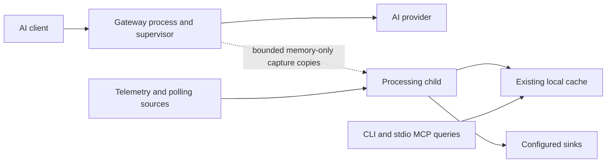

# LLP 0038: Separate gateway and processing daemons

**Type:** RFC
**Status:** Draft
**Systems:** Daemon, Gateway, Core, Cache, Plugins, Sources, Sinks, Config
**Author:** Phil / Codex
**Date:** 2026-06-25
**Updated:** 2026-09-08
**Related:** LLP 0017, LLP 0016, LLP 0050, LLP 0054, LLP 0070, LLP 0371

## Purpose

A query, backfill, export, or cache-maintenance operation that stalls or exhausts
its heap must not interrupt gateway forwarding, including an active SSE stream.
Separate processes isolate JavaScript heaps, garbage collection, and event loops.
They do not reserve physical RAM, CPU, or disk bandwidth on the host.

Investigation at `8466df33` found that the daemon ran the gateway alongside
scheduled recovery, sinks, settlement, compaction, retention and config/update
work. The gateway recorder also buffered whole exchanges and synchronously
decoded compressed bodies; its projector read storage for deduplication.
`storage.appendRows` could trigger a 512 MiB size-threshold flush in its caller.
Moving only daemon timers would leave those heavy paths in the forwarder.

Local CLI queries and stdio MCP already execute in separate caller processes.
Join-time backfill already uses a child; scheduled recovery ran in the daemon.
Their query/cache APIs remain unchanged by this implementation.

## Implemented boundary

The existing installed service runs `runGatewayDaemon`. It owns the provider
listener and supervises one processing child. The child runs the existing kernel
daemon, with a capture receiver in place of the provider listener. A child crash
or ordinary stop restarts only the child after a bounded delay (one second,
backing off to thirty seconds for repeated short-lived failures). The gateway's
PID, sockets, routing and in-memory ignored-session set survive.

The gateway activates configured gateway contributors and their configured
dependencies so adapter-owned route callbacks retain their closures and existing
precedence. It starts only the `ai-gateway` source, never sinks, recovery or other
sources. Its storage facade permits path construction and rejects cache access.
Adapter projection hooks can register, but are never invoked there. Registration
still imports shared kernel/adapter code; arbitrary third-party activation code
is trusted plugin code, not a separately sandboxed execution boundary.

The processor owns decoding, SSE interpretation, message expansion, adapter
privacy/context resolution, deduplication, all live capture writes, normal kernel
background work, passive listeners, client reconciliation and self-update. It
receives the proven gateway endpoint for attach, but never binds that port.
Its source reload/stop closes only the capture receiver. Passive telemetry may
be lost during processor outages; it does not carry provider traffic.

The gateway process is the lightweight supervisor, not a child of the heavy
processor. launchd/systemd supervise that process through the existing service
label and command. Processor exceptions, aborts, or heap exhaustion do not
cause the service manager to restart it. A gateway crash still restarts the
service; an orphan processor exits when its private IPC connection disconnects.

## Capture transport and privacy

Use Node's inherited parent/child IPC channel with advanced serialization. No
loopback HTTP API, shared raw spool, credentials file, or new runtime dependency
is needed. This channel is private to the processes launched by the service.

The gateway sends redacted request/response headers and raw body chunks as
capture copies. It performs no body concatenation, decompression, message
projection, transcript discovery, or cache scan. Chunk frames are at most
64 KiB. Socket backpressure between client and provider remains ordinary Node
stream backpressure; capture backpressure never reaches that stream.

The gateway limits outstanding IPC copies to 4 MiB and 256 frames, with 32 active
captures and 16 MiB per capture. Credits return when the processor consumes a
frame, not when Node merely queues it for writing. The processor also limits
active/finishing captures and total retained raw bytes. Capture lifetime is
bounded to 30 minutes. These are conservative internal capture limits, not
forwarding limits or guarantees about maximum processor RSS after decoding.

When the processor is absent, blocked, restarting, or over budget, the affected
recording is abandoned and its buffers are released. Forwarding continues.
Drops are counted and reported as structured lifecycle/status signals. Partial
captures are not normalized as complete exchanges. Recording resumes for new
exchanges when the child is ready; an exchange cannot resume halfway through.

Session opt-out remains gateway-owned. A bounded snapshot of opaque ignored
session IDs accompanies a completed capture and is passed to that exchange's
projector, so restarting the processor does not erase the gateway opt-outs.
An oversized snapshot drops recording rather than omitting an ignore rule.
The existing adapter `.hypignore` checks still execute before any persistence,
including the existing unknown-cwd and late-settlement behavior. Header
redaction includes configured additions before IPC transmission.

### Why there is no durable raw handoff

The initial investigation proposed a durable capture queue. Raw persistence
before adapter admission would retain content the current privacy boundary can
drop entirely. Preserving that boundary while moving all projection out would
require new bounded admission contracts and an upgrade/replay protocol.

The user's clarified requirement is availability of gateway forwarding during
heavy-work failure. A bounded memory-only handoff meets that requirement while
preserving the current persistence boundary. A processor crash may lose
uncommitted recordings. Existing transcript recovery may recover some supported
client history; it is not a guarantee for arbitrary raw traffic. Lossless
capture across processor outages is not claimed.

There is no new on-disk envelope, dataset field, ingest sequence, or cursor
format. Only the processor uses the ordinary live capture spool. The gateway
cannot trigger its size-threshold flush. Existing CLI/cache cross-process writer
races remain the separately documented work in LLP 0371; this split neither
uses that spool as IPC nor introduces a second live gateway writer.

## Lifecycle and operator behavior

Primary PID, status, control and log paths remain at the existing state root.
The processor's runtime files live below `hypaware/processing`; cache, plugin
state and config paths remain shared at their existing locations. Each process
writes its own status file. The gateway aggregates processor status on read,
checks the child PID and heartbeat, and publishes independent process health.
Gateway endpoint and ignore information comes from the gateway itself;
recording statistics come from the processor.

A stale, degraded or dead processor degrades aggregate health without declaring
the forwarding listener stopped. Status exposes both PIDs and processor restart
count. `hyp daemon restart --processing` asks the gateway to replace its child
through a private control directory under `processing/supervisor`. The gateway
allows four seconds for graceful shutdown, then kills a stuck child. Ordinary
install/start/stop/restart/uninstall remain
whole-service operations with the same service files and labels.

An explicit service-wide reload or a processor's config/code restart request
(exit 75) replaces both roles. These are intentional lifecycle changes and may
interrupt streams. A heap crash or ordinary child exit is never interpreted as
a request to restart the gateway. Processor scheduling priority is lowered where
the OS supports it; query budgets still apply in their existing processes.

The processing daemon still owns config probation, reconciliation and update
application. First bind precedes processor attach. A central-config replacement
or code update requests a complete restart through the existing exit-75 path.
Shutdown has a deadline so a stuck child or indefinitely open stream cannot
strand service restart. No zero-downtime package upgrade is promised.

Upgrade needs no extra service installation: after the old service stops, its
existing command starts the gateway supervisor and child. Downgrade has no new
raw spool to understand. Real installed macOS/Linux lifecycle acceptance still
needs to verify service-manager behavior, including child cleanup.

## Verification and remaining limits

Traditional tests cover IPC credits/backpressure, recording loss visibility,
configured header redaction and privacy snapshots. A hermetic process-isolation
smoke checks separate source ownership and restart/status behavior, streams through the
gateway while deliberately exhausting the processing child's heap, checks that
the gateway PID and stream survive, replaces a blocked processing child through
the processing-only restart command, and proves recording recovers afterward.
It also verifies lifecycle telemetry with a stable run ID and smoke step.

Run the traditional suite, typecheck, existing gateway/daemon/policy smokes, and
the new isolation smoke. Before release run the full smoke battery and real
Mac/Linux installed-service checks. The adapter/capture changes require their
real-client acceptance procedures in `docs/ACCEPTANCE.md`; fixtures do not prove
upstream client behavior. No persistent data format changed, so a new durable
queue upgrade gate is not implied by this implementation.

The CPU/memory pass must verify no capture body or storage work remains in the
gateway, bounded IPC accumulation while processing is stalled, and bounded
restart cadence. Processor decoded bodies and native buffers can still exceed
its heap budget; their failure must remain isolated. Host-wide OOM or severe
CPU/I/O starvation can affect either process despite separate heaps. Resource
reservation and durable outage capture are separate requirements, not hidden
guarantees of this split.

This draft extends LLP 0017's single-process lifecycle and LLP 0016's combined
listener/recording execution. It preserves the adapter-owned persistence checks
of LLP 0050 and the export withholding seam of LLP 0070. It remains a draft
until implementation verification and review are complete.

### Implementation validation (2026-09-08)

- `npm test`: 6,178 passed, three skipped, zero failures.
- `npm run typecheck`: passed.
- `gateway_process_isolation`: passed with actual child `SIGABRT` from heap
  exhaustion and `SIGKILL` for the intentionally blocked child. The same gateway
  PID and SSE connection survived both; subsequent recording reached the cache.
- Existing smokes passed: `gateway_codex_capture`, `gateway_claude_capture`,
  `daemon_foreground_start_stop`, `daemon_install_render`,
  `hypignore_capture_drop`, `local_only_export_withhold`, `status_diagnostics`.
- CPU/memory review: gateway capture copies and concurrency are bounded, body
  decoding/projection/storage run in the child, and repeated short-lived child
  failures back off to thirty seconds. Shared host resource exhaustion remains
  outside the process-isolation guarantee.
- Real installed-service and real-client acceptance have not been run. The
  implementation and smoke runs did not replace the user's installed daemon.
